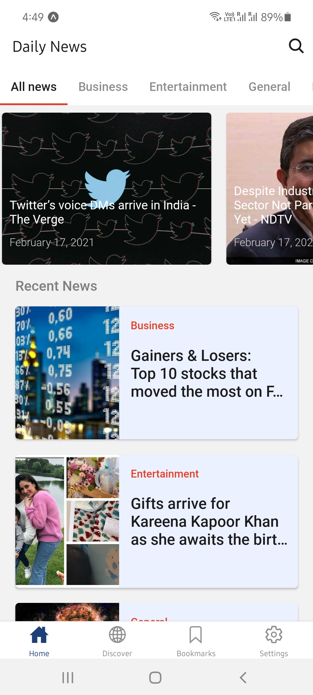
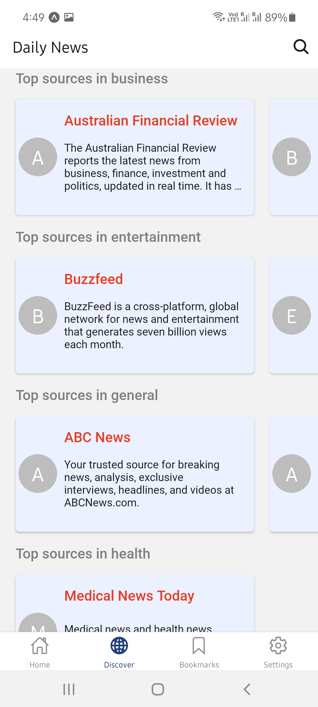
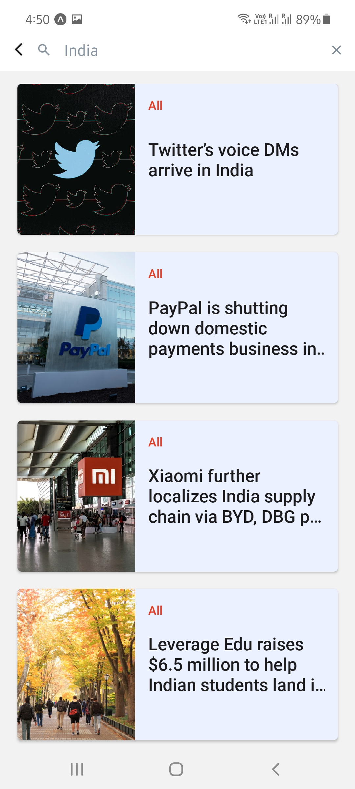
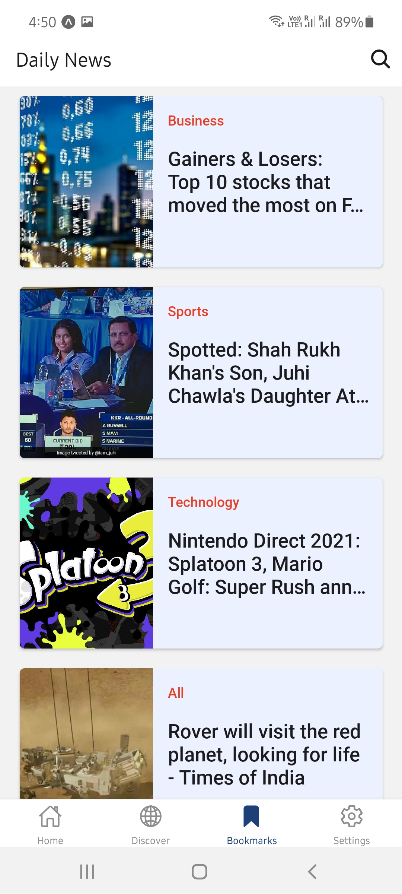
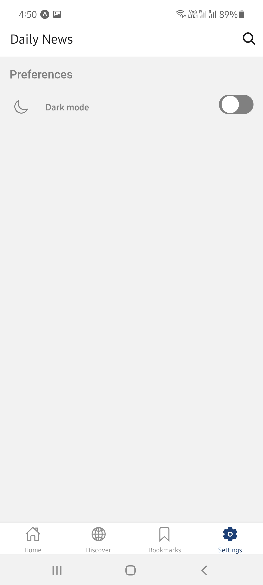
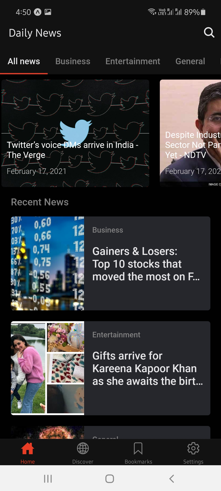

# daily-news
News application using React Native and News API in Express JS. Made with Expo and fully compatible on Android and iOS. Currently shows news and sources for India only.

## See also

- Server code: https://github.com/Death14Stroke/daily-news-server
- UX inspired: https://www.behance.net/gallery/102996435/News-App-Design?tracking_source=search_projects_recommended%7Cnews%20app%20mobile

## Outputs

| | | |
|:-------------------------:|:-------------------------:|:-------------------------:|
 View top headlines easily |  Discover sources for various kinds of news |
| Search news by keywords |  Bookmarks news to read later offline |
|  Read details |  Customize look and feel |
|  Catch up highlights of the day before bed |  Dark mode for reading |
